### 1、下载Spring源码

Spring 官网：https://spring.io/

我们可以在 github 或者 gitee 上都能下载到 Spring 的源码。

https://github.com/spring-projects/spring-framework

根据选择分支或者Tag下载指定版本的 Spring 源码。可以使用压缩包或者git clone下载。

本版本使用的是**5.2.25.RELEASE**。

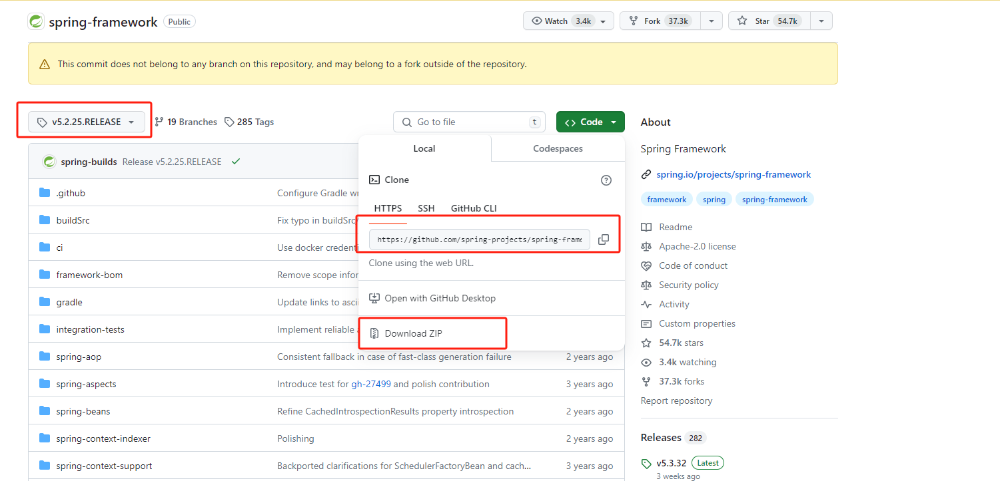


### 2、安装Gradle 

#### 2.1、下载gradle

从[Gradle官网](https://gradle.org/) 下载指定的gradle版本，具体使用版本建议使用当前下载使用的Spring源码中指定的gradle版本，具体版本可以参照`spring-framework-xxx\gradle\wrapper\gradle-wrapper.properties`文件中的版本：

```properties
distributionUrl=https\://services.gradle.org/distributions/gradle-xxx-bin.zip
```

并解压。

下载页（选择其一）：

* https://gradle.org/releases/ 
* https://services.gradle.org/distributions/


#### 2.2、配置gradle环境变量

1. 添加如下两个环境变量

```properties
变量名：GRADLE_HOME
变量值：gradle的解压地址
```

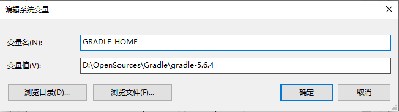

```properties
变量名：GRADLE_USER_HOME
变量值：gradle仓库目录（可以使用maven的仓库目录）
```

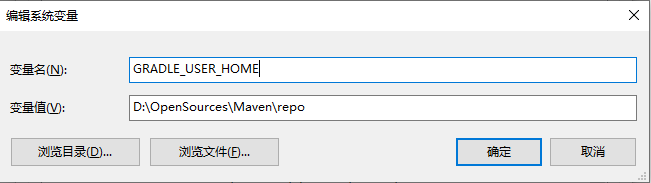

2. 将如上两个环境变量添加到Path路径里

```text
%GRADLE_HOME%\bin
%GRADLE_USER_HOME%
```


#### 2.3、验证gradle

```text
gradle -v
```

出现如下结果，说明安装成功。

```text
------------------------------------------------------------
Gradle 5.6.4
------------------------------------------------------------

Build time:   2019-11-01 20:42:00 UTC
Revision:     dd870424f9bd8e195d614dc14bb140f43c22da98

Kotlin:       1.3.41
Groovy:       2.5.4
Ant:          Apache Ant(TM) version 1.9.14 compiled on March 12 2019
JVM:          11.0.9 (Oracle Corporation 11.0.9+7-LTS)
OS:           Windows 10 10.0 amd64
```

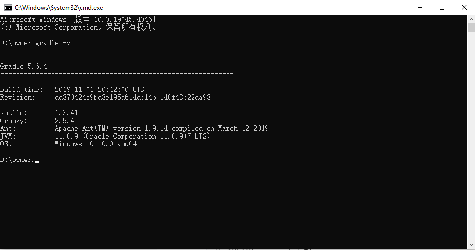

### 3、导入前准备

为了加速 `gradle` 下载依赖包的速度，我们需要在 `build.gradle` 和 `settings.gradle` 这两个文件中添加国内的镜像地址。这里使用aliyun。

#### 3.1、build.gradle 文件

```groovy
repositories {
    // 新增aliyun的maven镜像仓库
    maven { url "https://maven.aliyun.com/nexus/content/groups/public"}
    maven { url "https://maven.aliyun.com/nexus/content/repositories/jcenter"}
    
    maven { url "https://repo.springsource.org/plugins-release"}
    mavenCentral()
}
```
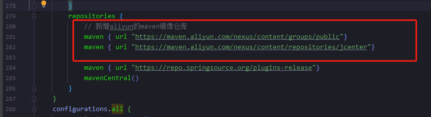

#### 3.2、settings.gradle 文件

```groovy
pluginManagement {
	repositories {
		// 添加aliyun的maven镜像仓库
		maven { url 'https://maven.aliyun.com/nexus/content/groups/public' }
        
		gradlePluginPortal()
		maven { url 'https://repo.spring.io/plugins-release' }
	}
}
```
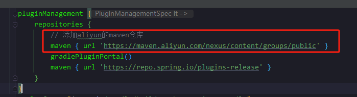

#### 3.3、gradle-wrapper.properties 修改

将 `spring-framework\gradle\wrapper\gradle-wrapper.properties` 文件中的 `distributionUrl` 修改成自己下载的gradle。

```properties
# 将远程gradle下载地址替换成本地已下载的gradle压缩包
#distributionUrl=https\://services.gradle.org/distributions/gradle-5.6.4-bin.zip
distributionUrl=file\:///D:/OpenSources/Gradle/gradle-5.6.4-bin.zip
```

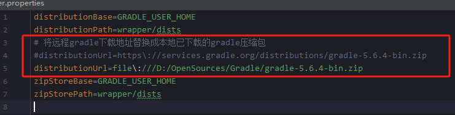


### 4、编译源码

#### 4.1、导入源码

通过IDEA导入源码，然后需要配置IDEA的JDK版本，以及Gradle配置。

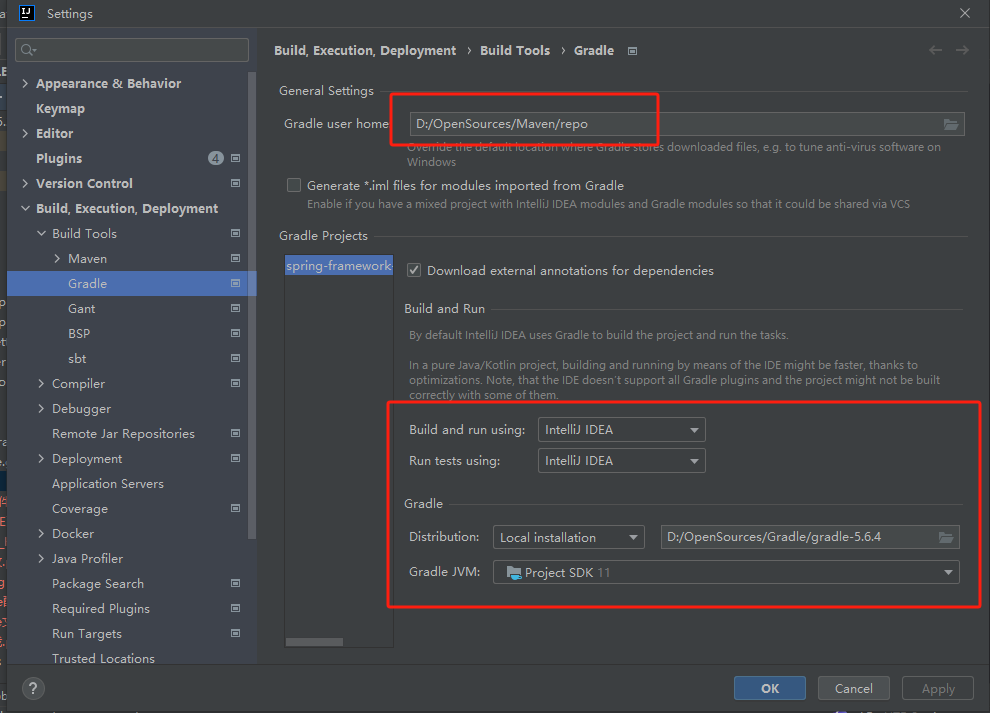

当看到每一个项目基本上都带着一个 蓝色方块，就表示 Spring 的源码导入成功了。


#### 4.2、预编译

根据`import-into-idea.md` 里面的说明，需要预先编译 `spring-oxm` 模块，
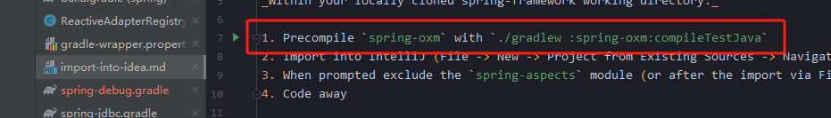

则在项目根目录下执行如下命令：
```text
gradlew.bat :spring-oxm:compileTestJava
```
结果如下：
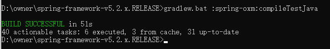


#### 4.3、问题

##### 4.3.1、Kotlin: warnings found and -Werror specified

在编写测试代码之后，运行会报如下错误：

```text
Kotlin: warnings found and -Weeror specified
```

这个问题出现的原因是 缺少 **cglib** 和 **objenesis** 包。

则需要在项目的根目录下执行如下命令：

```text
gradle objenesisRepackJar
gradle cglibRepackJar
```

或者使用如下方式：

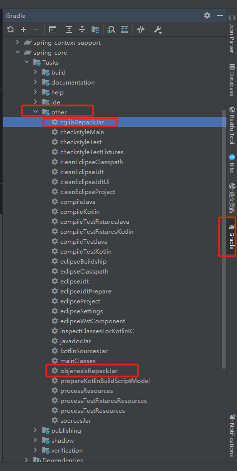

如果在执行过程中还是报 Kotlin 相关的 -Werror 错误的话， 将**所有模块**中含有 Kotlin 的地方，将命令行参数中的 `-Werror` 去掉，或者根据提示依次删除编译过程中依赖的模块命令行参数，如下：

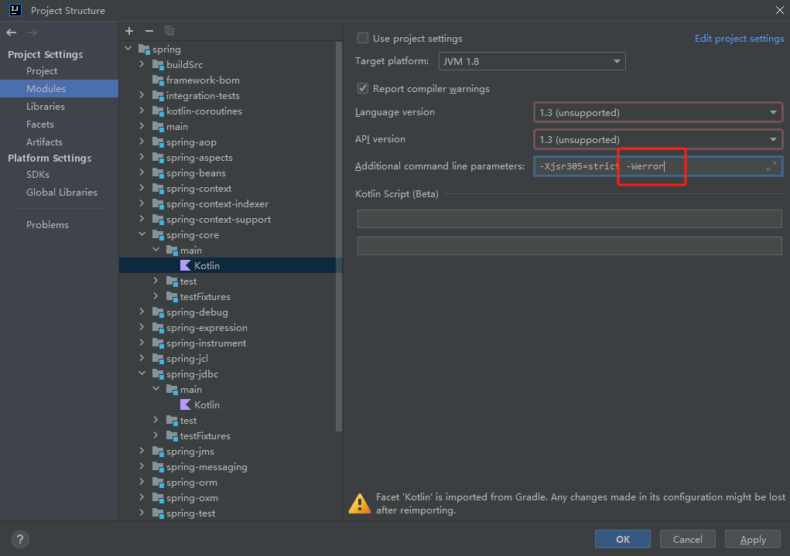


##### 4.3.2、java: 找不到符号：变量 CoroutinesUtils

这是因为 `CoroutinesUtils` 是 `kotlin` 的一个工具类，Spring 源码包读取不到，所以需要手动添加 `kotlin-coroutines-5.2.25.RELEASE.jar` 到 `Libraries` 中。

首先需要编译Spring的项目文件，会在 `spring-core\kotlin-coroutines `目录下生成 build 目录，如图：

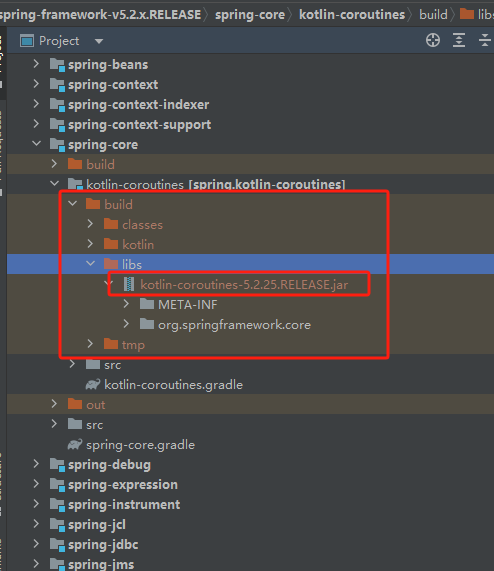

然后点击 `File` -> `Project Structure` -> `Libraries` -> `+` -> `Java`。

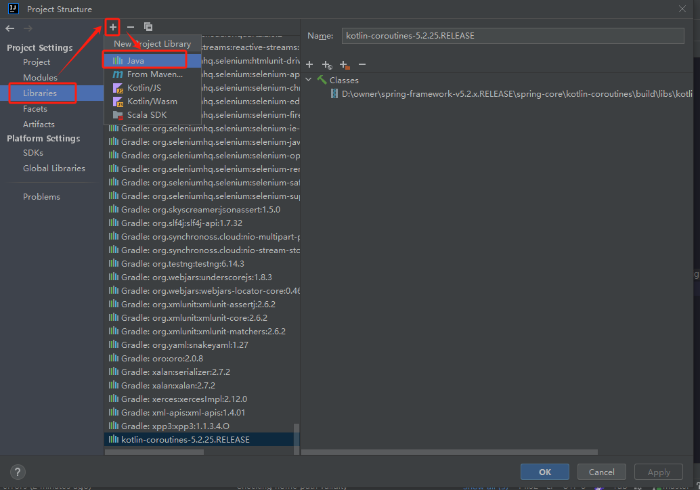

然后选择 `spring-framework/spring-core/kotlin-coroutines/build/libs/kotlin-coroutines-5.2.25.RELEASE.jar` 点击 `OK`  。

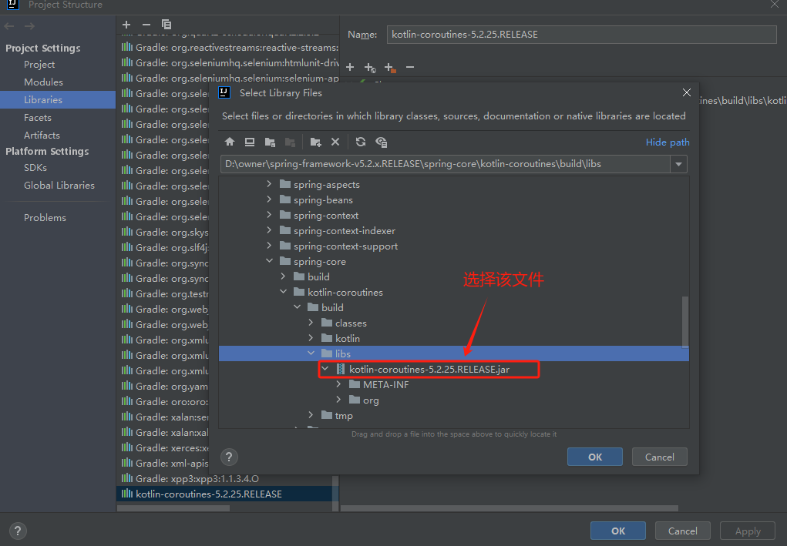

然后就会跳出一个选择 modules 的页面，选中 `spring.spring-core.main` 点击 `OK` 即可。

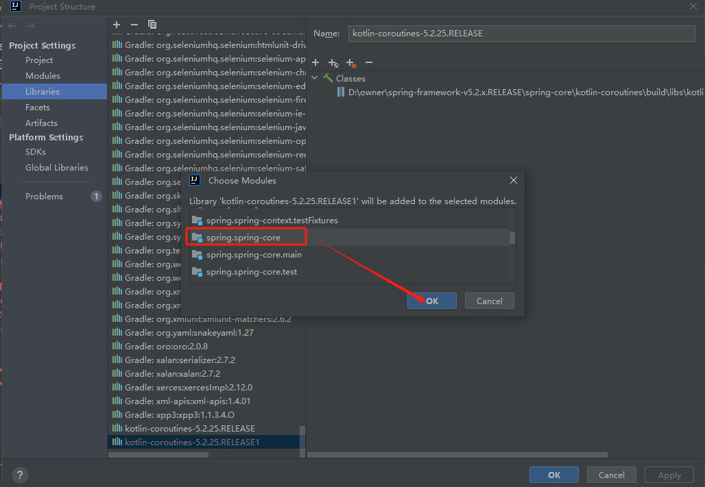


### 5、测试

#### 5.1、创建module

正常创建一个 `spring-debug` 模块，在依赖加载 `spring-context`

`build.gradle` 文件内容如下：

```gradle
plugins {
    id("java")
}

group = "org.springframework.debug"
version = "5.2.25.RELEASE"
description = "Spring Debug"

repositories {
    mavenCentral()
}

dependencies {
	compile(project(":spring-context"))
//	compile(project(":spring-aspects"))  //引入aop&切面模块
    testImplementation(platform("org.junit:junit-bom:5.9.1"))
    testImplementation("org.junit.jupiter:junit-jupiter")
}

tasks.test {
    useJUnitPlatform()
}
```

`spring-base.xml`

```xml
<?xml version="1.0" encoding="UTF-8"?>
<beans xmlns="http://www.springframework.org/schema/beans"
	   xmlns:xsi="http://www.w3.org/2001/XMLSchema-instance"
	   xsi:schemaLocation="http://www.springframework.org/schema/beans http://www.springframework.org/schema/beans/spring-beans.xsd">

	<bean id="user" class="org.springframework.debug.entity.User">
		<property name="id"	value="1"/>
		<property name="name" value="caychen"/>
	</bean>
</beans>
```

```java
// Main.java
public class Main {

	public static void main(String[] args) {
		ClassPathXmlApplicationContext ctx = new ClassPathXmlApplicationContext("classpath:/spring-base.xml");
		User user = ctx.getBean("user", User.class);

		System.out.println(user);
	}
}
```

```java
// User.java
public class User {

	private Long id;

	private String name;

	public Long getId() {
		return id;
	}

	public void setId(Long id) {
		this.id = id;
	}

	public String getName() {
		return name;
	}

	public void setName(String name) {
		this.name = name;
	}

	@Override
	public String toString() {
		return "User{" +
				"id=" + id +
				", name='" + name + '\'' +
				'}';
	}
}
```

执行Main.main方法，结果返回如下则说明成功运行。

```text
User{id=1, name='caychen'}
```

